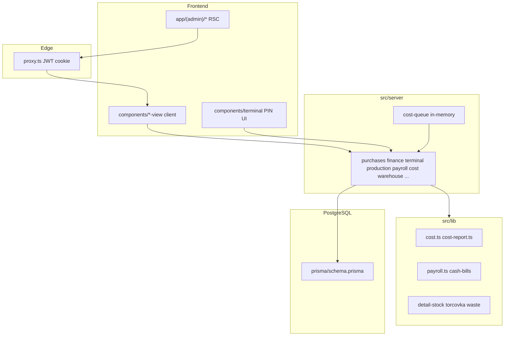

# Аудит ERP Stell22 — итоговый отчёт

**Коммит:** `5268259` (совпадает с graphify).  
**Дата аудита:** 2026-07-12.  
**Режим:** только анализ, код не изменялся.  
**Правила в контексте:** workflow, testing, cost-integrity, safe-changes, graphify, git-github, form-dialogs, scrollbars.

Источник истины для расчётов: раздел «МОДЕЛЬ СЕБЕСТОИМОСТИ» в `Описание проекта v2.txt`.

---

## Общее заключение

| Проверка | Результат |
|----------|-----------|
| Typecheck (`npx tsc --noEmit`) | OK (exit 0) |
| Lint (`npm run lint`) | OK, 1 warning в `scripts/probe-ozon-supply-get.ts` |
| Тесты (`npm test`) | **31 files / 242 tests — все зелёные** |
| Build (`npm run build`) | OK |
| Миграции (`prisma migrate status`) | **up to date** (23 миграции), Postgres healthy на `:5434` |
| Запуск приложения (live HTTP) | **не проверен** — dev-сервер не был поднят; health недоступен |
| Архитектура | **смешение**: server/Prisma для операционных модулей; моки для settings/типов/KPI-хелперов; `ProductCost`/`closeMonth` не реализованы; BlankStock-рефактор разорвал партию-источник для изделий |
| Безопасность продолжать разработку без фиксов | **Условно можно** UI/справочники/терминал-остатки; **нельзя** опираться на отчёт себестоимости изделий, статус FINAL, инвентаризацию деталей с частичной присадкой, зарплатную неделю пт–чт |

**Вердикт:** проект **собирается и тестируется**. Критичные искажения денег — в **отчёте/снапшотах/заморозке**, не в атомарности склада терминала. После BlankStock-потока (`b005b6c`…`5268259`) детальный отчёт по партиям жив, изделие — через blend по породе.

---

## Карта архитектуры



| Область | UI | Server | Бизнес-логика |
|---------|-----|--------|---------------|
| Frontend | App Router + shadcn | — | форматирование `lib/format.ts` |
| Backend | — | `src/server/*.ts` server actions | почти нет REST (только health + cron) |
| БД | — | Prisma | Decimal(14,2) деньги |
| Auth | `/login` | `auth.ts` / `session.ts` / `proxy.ts` | JWT httpOnly; терминал публичный + PIN на клиенте |
| Закупки | `purchases-view` | `purchases.ts` | `batch-stats`, `deal-cost` |
| Производство/терминал | `terminal/*`, `production-view` | `terminal.ts`, `production.ts` | `detail-stock`, `torcovka` |
| Склад | `warehouse-*` | `warehouse.ts` | `warehouse-stock` |
| Себестоимость | `report-cost-tab` | `cost.ts` | **`lib/cost.ts`** + **`lib/cost-report.ts`** (два пути) |
| ЗП | `report-salaries-tab` | `payroll.ts` | `lib/payroll.ts`, `cash-bills`, `pay-weeks` (не подключён) |
| Финансы | `finance-*` | `finance.ts` | `bank-statement-1c`, `account-balance`, `auto-rule-match` |
| Отчёты/дашборд | `reports-view`, `dashboard-*` | `reports.ts`, `dashboard.ts` | частично те же lib; фильтры дат часто декоративны |
| Интеграции | sales/settings | `marketplace.ts`, `statement-mail.ts` | Ozon/WB stubs→API; банк по IMAP |

---

## Таблица проблем

| ID | Критичность | Статус | Модуль | Проблема | Доказательство | Сценарий возникновения | Последствие | Рекомендация |
|----|-------------|--------|--------|----------|----------------|------------------------|-------------|--------------|
| A1 | CRITICAL | SPEC-MISMATCH | cost | Материал изделия — blend по породе, не по партии-источнику | `src/lib/cost-report.ts:271-294`, `:448-456`; BlankStock без `batchId` (`prisma/schema.prisma:393-404`); v2:650-652 | Две партии одной породы с разной C; упаковка изделия | Неверная себестоимость SKU | Трассировать batch через операции или FIFO; либо явно зафиксировать в v2 «норматив по породе» |
| A2 | CRITICAL | CODE-CONFIRMED | cost | `P1=P2=0` при производстве → материал 0, C теряется | `src/lib/cost.ts:88-104`; defaults `src/server/purchases.ts:218` | Партия с C>0, цены 0, есть торцовка | Материал в отчёте/снапшоте = 0 | Валидация P1/P2>0 или fallback по объёму + тест |
| A3 | CRITICAL | CODE-CONFIRMED | cost | `getCostReport` не читает `BatchCost`; всегда live-пересчёт | `src/server/cost.ts:166-204` vs `:260-284` | Закрытая/замороженная партия + новые ops других партий | Два источника истины; FINAL write-only | Читать FINAL при `frozenAt`; live только для открытых |
| A4 | CRITICAL | CODE-CONFIRMED | cost | UI-статус FINAL = `ARCHIVED`, не `frozenAt` | `src/lib/cost-report.ts:336` | Партия в архиве, ЗП не выплачена | Показан «Итог», снапшот ещё PRELIMINARY и пересчитывается | `costStatus` из `frozenAt` / `BatchCost.status` |
| A5 | CRITICAL | SPEC-MISMATCH | cost | Заморозка: `closedAt` **и** все TORCOVKA `isPaid` | `src/server/cost.ts:330-350`; v2:686-688; cost-integrity «при закрытии» | Партия выработана, ЗП не выплачена | Расхождение спека↔код; roadmap «closeBatch freeze» — функции `closeBatch` нет | Согласовать v2: freeze = paid+closed **или** freeze на closedAt |
| A6 | CRITICAL | SPEC-MISMATCH | cost | Работа в отчёте = среднее rates справочника, не факт ops | `src/lib/cost-report.ts:102-118,444`; v2:696-701 | Разные расценки работников | Неверная «работа» в себестоимости | Агрегировать `operationEarning` / факт avg |
| A7 | HIGH | CODE-CONFIRMED | production | Сервер не валидирует длину заготовок ≤ взятые рейки | `src/server/terminal.ts:209-286`; UI `torcovka-screen.tsx` | Прямой вызов server action | Раздувание заготовок/искажение отхода | Вызвать `isOverRailLength` в `submitTorcovka` |
| A8 | HIGH | CODE-CONFIRMED | production | Правка TORCOVKA вверх без бюджета реек | `src/server/production.ts:316-334` | Админ увеличивает qty | Те же искажения | Проверка `railsTaken * lot.lengthM` |
| A9 | HIGH | CODE-CONFIRMED | warehouse | Инвентаризация DETAIL: partial buckets не обнуляются | `src/server/warehouse.ts:315-354` | Есть (true,false) + факт в ready | Инфляция остатков | Обнулить/перераспределить все buckets детали |
| A10 | HIGH | SPEC-MISMATCH | warehouse | Нет split сырьё→отход / ГП→«Потеря ГП» | `src/server/warehouse.ts:288-291`; v2:526-532 | Недостача при инвентаризации | Неверная аналитика отхода/финансов | Реализовать по v2 (roadmap откладывал) |
| A11 | HIGH | CODE-CONFIRMED | cost | Накладные без фильтра периода — всё время | `src/server/cost.ts:150-157` | Старые накладные + текущее производство | Завышенные/заниженные накладные на ед. | Фильтр по периоду отчёта |
| A12 | HIGH | CODE-CONFIRMED | payroll/reports | Неделя пт–чт и FiltersBar не подключены к данным | `src/lib/pay-weeks.ts`; `reports-view.tsx:196-212`; `payroll.ts:177-182` | Выплата «за неделю» | Выплата всех unpaid; фильтр-обманка | Прокинуть week filter + scope payout |
| A13 | HIGH | CODE-CONFIRMED | finance | Карантин: deal/batch.totalCost/overhead без `confirmed` | `finance.ts:1117-1127` vs `:218-227`; `cost.ts:152-157` | Импорт на неподтверждённый счёт | C партии меняется до появления в ДДС | Единое правило confirmed для cost/deal |
| A14 | HIGH | ARCHITECTURAL-RISK | auth | Терминал: PIN только на клиенте; actions без auth | `src/proxy.ts`; `terminal.ts:209` | Любой с сетью вызывает submit* | Несанкционированные операции | Серверная проверка employee+PIN/session |
| A15 | HIGH | ARCHITECTURAL-RISK | cost | Дубли: `computeBatchSnapshot` vs `buildBatchSnapshots`; labor/material helpers | `server/cost.ts:219-251`; `lib/cost-report.ts:153-192` | Правка одной копии | Тихий drift формул | Один путь расчёта |
| A16 | MEDIUM | CODE-CONFIRMED | terminal | ProductExtra не списывается при упаковке | `src/server/terminal.ts:554-667` | Изделие с extras | Cost учитывает, stock нет | Списание в `applyUpakovkaPick` |
| A17 | MEDIUM | ARCHITECTURAL-RISK | cost | `ProductCost` мёртвая модель; закрытие месяца нет | `prisma/schema.prisma:703-723`; roadmap:186 | Конец месяца | Нет FINAL накладных | `closeMonth` job |
| A18 | MEDIUM | CODE-CONFIRMED | purchases | `costMismatch` float ≠ `isBatchCostMismatch` | `purchases.ts:45-50` vs `lib/cost.ts:160-172` | Доставка в totalCost | Ложный/пропущенный mismatch | Использовать lib + totalCost |
| A19 | MEDIUM | SUSPECTED | payroll | Параллельный `markEmployeePaid` TOCTOU | `src/server/payroll.ts:177-207` | Два клика «Выплачено» | Два Payment | `updateMany` where isPaid=false + check count |
| A20 | MEDIUM | ARCHITECTURAL-RISK | settings | Параметры/min stock на моках | `settings-view.tsx` | Смена порога отхода | Не персистится | БД или пометить prototype |
| A21 | MEDIUM | CODE-CONFIRMED | terminal | Нет idempotency key на submit | `terminal.ts` submit* | Double-tab до setSubmitting | Дубль операции (если хватит stock) | clientRequestId unique |
| A22 | LOW | CODE-CONFIRMED | auth | Большинство server actions без `requireAdmin` | session только layout/settings/1 MP | Будущие роли | Privilege escalation risk | DAL в каждом экшене |
| A23 | LOW | CODE-CONFIRMED | lint | unused import в probe-скрипте | eslint warning | — | шум CI | удалить import |

**Позитивные подтверждения (не проблемы):**

- атомарная упаковка + `updateMany` gte;
- присадка buckets + `isReady`;
- нельзя уйти в минус на рейках;
- удаление партии с движениями запрещено;
- доставка через deal extra без двойного DDS;
- ЗП вне isOverhead в seed;
- ядро `distributeBatchCost` + cost-flow тесты;
- импорт выписки с importKey.

### Легенда

**Критичность:** BLOCKER / CRITICAL / HIGH / MEDIUM / LOW  

**Статус:**

- `CONFIRMED` — воспроизведено runtime
- `CODE-CONFIRMED` — однозначно следует из кода
- `SUSPECTED` — высокий риск, нужны данные/гонка
- `SPEC-MISMATCH` — расхождение со спецификацией
- `ARCHITECTURAL-RISK` — риск архитектуры

---

## 1. Критические нарушения бизнес-логики

1. **Себестоимость изделий** усредняет материал по `materialId` (A1) — прямое нарушение «учёт строго по партии-источнику». Причина: BlankStock без `batchId` после рефактора заготовок.
2. **P1=P2=0** обнуляет распределение C (A2).
3. **FINAL/заморозка** (A3–A5): UI врёт статусом; снапшоты не источник для отчёта; freeze ≠ формулировка v2.
4. **Работа** в отчёте не из факта производства (A6).
5. **Склад:** инфляция при инвентаризации partial (A9); нет «Потеря ГП»/отход сырья (A10).
6. **Производство:** обход UI длины торцовки (A7–A8) искажает отход и C/м³.

Ошибки, способные исказить: себестоимость, остатки, зарплату (период выплаты), отход, финансы (карантин→C), готовность деталей (OK), количество ГП (упаковка OK, extras — нет).

---

## 2. Архитектурные последствия изменений

### Новое (BlankStock flow + Material)

- `BlankStock` `(materialId, lengthM, type, sort)` — пул без партии
- Номер детали, dual SKU, Material entity
- Провенанс на `OperationDetailLine` для reverse

### Старое, ещё живое

- `BatchCost` пишется, почти не читается отчётом
- `ProductCost` — схема без writers
- Моки: types, settings UI, KPI helpers в `finance-fixtures` / `report-fixtures`
- Roadmap отмечает `closeBatch` freeze — в коде `archiveBatchIfDepleted` + `maybeFreezeBatch(paid)`

### Сосуществование путей расчёта

| Путь | Роль |
|------|------|
| `lib/cost.distributeBatchCost` | движок партии (тесты OK) |
| `lib/cost-report` | отчёт (blend + averageRates) |
| `server/cost.computeBatchSnapshot` | параллельная копия агрегации в БД |

Единый источник бизнес-логики **есть** для ядра материала партии (`lib/cost.ts`), **нет** для: материала изделия, статуса FINAL, работы в отчёте, накладных периода, готовности детали (есть в `detail-stock`, OK).

---

## 3. Расхождения со спецификацией

| Требование (v2) | Текущая реализация | Влияние | Рекомендуемое решение |
|-----------------|--------------------|---------|------------------------|
| Материал строго по партии | Blend по породе для изделий | Неверная полная С/С SKU | Batch trace или правка v2 |
| Freeze при закрытии партии | Freeze при closedAt + paid TORCOVKA | PRELIMINARY дольше | Согласовать документ |
| Работа = факт / оклад÷ops | averageRates карточек | Неверная «работа» | Факт из ops |
| Накладные периода + close month | Все EXPENSE overhead; ProductCost мёртв | Нет FINAL месяца | Период + closeMonth |
| Инвентаризация raw/FG split | Только stock adjust; нет финпроводки | Искажение отхода/ДДС | Этап по v2 |
| ЗП неделя пт–чт | `pay-weeks` есть, UI/server не используют | Неверные выплаты по периоду | Wire filter |
| Упаковка списывает состав | extras не списываются | Расхождение cost/stock | Списать extras |

---

## 4. Ошибки, которые уже воспроизводятся

```bash
cd D:/dev/St
npx tsc --noEmit          # OK
npm test                  # 242 OK — баги логики не ловятся отсутствием кейсов
npm run build             # OK
npm run lint              # 1 warning
npx prisma migrate status # up to date
```

**Логические (из кода, без UI):**

| ID | Как увидеть |
|----|-------------|
| A2 | `distributeBatchCost({ priceSort1:0, priceSort2:0, producedLength>0, totalCost>0 })` → `costSort=0` |
| A1 | `buildCostProductRows` → `blendedCostPerMeterByMaterial` |
| A4 | `costStatus: batch.status === "ARCHIVED" ? "FINAL" : "PRELIMINARY"` |
| A9 | `conductInventory` DETAIL upsert только ready-флаги |

Live HTTP/E2E **не гонялись** (сервер не запущен).

---

## 5. Риски, которые пока не воспроизводятся

| Риск | Что требуется для проверки |
|------|----------------------------|
| A19 двойная выплата | Два параллельных `markEmployeePaid` на test DB |
| A21 double-submit | Два concurrent `submitTorcovka` |
| A13 quarantine→C | Импорт на `confirmed=false` + deal |
| Live app smoke | `npm run dev` + логин + сквозной сценарий 1–18 |
| Миграция чистой БД | `migrate reset` — **только с явного «да»** |

---

## 6. Недостающие тесты

### Unit (срочно)

- P1=P2=0; P1=0 P2>0
- costStatus vs `frozenAt`
- нет blend при одной партии vs двух
- inventory partial buckets

### Integration (Prisma test DB)

- `submitTorcovka` length over budget
- `updateProductionLineQuantity` вверх
- `conductInventory` inflation
- `markEmployeePaid` concurrency
- freeze only when paid+closed
- `importStatement` idempotency
- quarantine vs `syncBatchTotalCost`

### E2E минимальный

1. Создать партию → пакеты сортов → стоимость → доставка через сделку  
2. Торцовка 1/2 сорта → отход → присадки → упаковка  
3. Склад → ЗП → предварительная С/С → закрытие партии → FINAL  
4. Правка новой ops → закрытая партия не пересчиталась  
5. Инвентаризация → сырьё vs потеря ГП  
6. Сверка отчётов/дашборда  

**Негативы:** нехватка материала/деталей/крепежа; повторное подтверждение; параллельное списание; удаление используемой партии; edit after pay; повтор выписки; нулевые цена/объём; незакрытая присадка; граница месяца/зарплатной недели.

Сейчас: сильные unit на `lib/cost|payroll|waste|detail-stock`; server actions — почти только `scripts/smoke-production-reversal.ts`.

---

## 7. План исправлений (не выполнять без отдельной команды)

1. **Сборка/запуск** — уже OK; убрать lint warning; задокументировать `.env` cron/mail.  
2. **Потеря данных** — A9 inventory; A19 payout lock; не запускать migrate reset без бэкапа.  
3. **Себестоимость/ЗП/склад** — A1→A6, A7–A8, A10–A12 (макс. риск регрессии: cost-report + BlankStock provenance).  
4. **API/UI** — FiltersBar, costStatus, settings persist, terminal auth (A14).  
5. **Очистка архитектуры** — единый snapshot path (A15), ProductCost или убрать из «готово» roadmap, моки только types.  
6. **Тесты** — список §6.  
7. **Рефакторинг без поведения** — Decimal в payroll amounts, sectionArea единый экспорт.

**Зависимости:** A1 блокирует корректные изделия до решения provenance; A3–A5 лучше делать вместе; A12 независим.

---

## Сквозные цепочки — краткий вердикт

| Цепочка | Вердикт |
|---------|---------|
| Закупка→рейки→C→deal delivery→склад→торцовка→отход→archive | В основном OK; freeze не на archive |
| Присадка→ready→упаковка txn | OK (без extras) |
| ЗП piece+hour, isPaid lock | OK формула; week/payout scope — FAIL |
| Себестоимость детали по партии | OK в detail rows (live) |
| Себестоимость изделия | FAIL (blend) |
| Инвентаризация | FAIL partial + no FG loss |
| Отчёты/фильтры дат | FAIL (декоративные) |

---

## Приоритет фиксов (когда будет команда)

1. A2 (P1=P2=0) + тесты  
2. A1 (batch provenance) или фиксация в v2  
3. A3/A4 (BatchCost read + costStatus)  
4. A6/A8/A7/A9  
5. A11/A12  
6. Остальное по критичности  

---

**Стоп.** Код по результатам аудита не менялся. Дальше — команда по конкретным ID (например: «чинить A1, A2, A4»).
